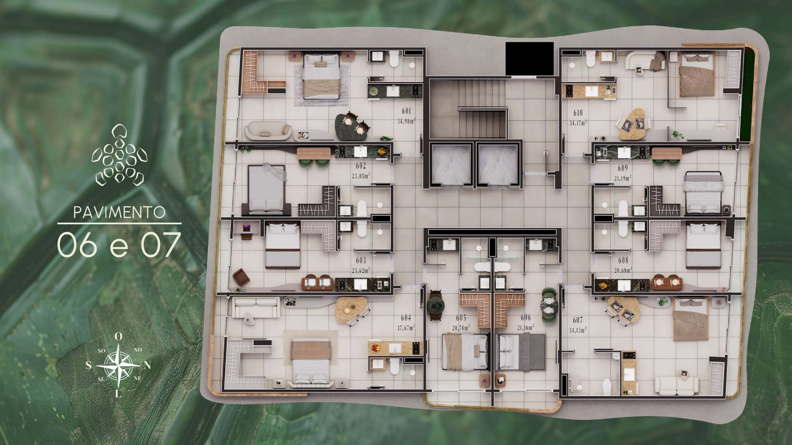

<!DOCTYPE html>
<html lang="pt-BR">
<head>
    <meta charset="UTF-8">
    <meta name="viewport" content="width=device-width, initial-scale=1.0">
    <title>MOSS - O equilíbrio perfeito entre o urbano e a natureza</title>
    <link rel="icon" href="imagens/favicon.ico" type="image/x-icon">
    <link rel="stylesheet" href="https://cdnjs.cloudflare.com/ajax/libs/font-awesome/6.0.0-beta3/css/all.min.css">
    
</head>
<body>
    <!-- Header -->
    <header>
        

            

                <svg width="64" height="64" viewBox="0 0 64 64">
                    <circle cx="32" cy="20" r="15" fill="#FFD700"/>
                    <rect x="20" y="25" width="24" height="30" fill="#1E90FF"/>
                    <path d="M10,50 Q32,45 54,50 L54,60 Q32,55 10,60 Z" fill="#87CEEB"/>
                </svg>
                <h1>MOSS</h1>
            

            
            

                

                

                

            

            
            <ul class="nav-links">
                <li><a href="#plantas">Plantas</a></li>
                <li><a href="#simule">Simule seu imóvel</a></li>
                <li><a href="#localizacao">Localização</a></li>
                <li><a href="#contato">Contato</a></li>
            </ul>
        

    </header>
    
    <!-- Hero Section -->
    <section class="hero">
        

            <h1>O equilíbrio perfeito entre o urbano e a natureza!</h1>
            
O MOSS é a tradução perfeita de sofisticação e visão de futuro. Um empreendimento pensado para quem valoriza localização privilegiada, qualidade de vida e retorno financeiro consistente.

            <a href="#contato" class="cta-button">Fale conosco</a>
        

    </section>
    
    <!-- About Section -->
    <section class="about">
        <h2 class="section-title">Sobre o MOSS</h2>
        
O MOSS reúne o melhor da vida urbana com o conforto e tranquilidade da natureza. Um empreendimento exclusivo que oferece flats de 20 a 34 m², perfeitos para quem busca praticidade sem abrir mão do luxo e do conforto.

        
Com localização privilegiada e arquitetura moderna, o MOSS é o lugar ideal para investidores e moradores que valorizam qualidade de vida e retorno financeiro.

    </section>
    
    <!-- Gallery Section -->
    <section class="gallery" id="plantas">
        

            <h2 class="section-title">Conheça o MOSS</h2>
            

                <!-- Primeiras 9 imagens visíveis inicialmente -->
                

                    
                

                

                    
                

                

                    
                

                

                    
                

                

                    
                

                

                    
                

                

                    
                

                

                    
                

                

                    
                

                <!-- Imagens adicionais que serão carregadas com o botão "Veja mais" -->
                

                    
                

                

                    
                

                

                    
                

                

                    
                

            

            <button class="load-more">Veja mais</button>
        

    </section>
    
    <!-- Modal de Imagem -->
    

        &times;
        

            
        

    

    
    <!-- Features Section -->
    <section class="features">
        <h2 class="section-title">Nossos Flats</h2>
        
Conheça nossos modelos de flats, perfeitos para quem busca praticidade e sofisticação.

        
        

            

                
                

                    <h3>Flat 20m²</h3>
                    
O espaço ideal para quem busca praticidade sem abrir mão do conforto. Perfeito para solteiros ou casais.

                

            

            
            

                
                

                    <h3>Flat 25m²</h3>
                    
Um pouco mais espaçoso, com área gourmet e layout inteligente que maximiza o espaço.

                

            

            
            

                
                

                    <h3>Flat 30m²</h3>
                    
Para quem deseja mais espaço e conforto, com área de lazer integrada e varanda gourmet.

                

            

            
            

                
                

                    <h3>Flat 34m²</h3>
                    
Nosso modelo mais espaçoso, com dois ambientes distintos e varanda ampla.

                

            

            
            

                
                

                    <h3>Áreas Comuns</h3>
                    
Espaços de lazer e convivência projetados para seu bem-estar e qualidade de vida.

                

            

            
            

                
                

                    <h3>Vista Privilegiada</h3>
                    
Aproveite vistas incríveis da cidade e do mar em alguns de nossos flats.

                

            

        

    </section>
    
    <!-- Location Section -->
    <section class="location" id="localizacao">
        

            <h2 class="section-title">Localização Privilegiada</h2>
            
O MOSS está situado em uma das áreas mais valorizadas da cidade, com fácil acesso a todas as regiões e próximo aos principais pontos de interesse.

            
            

                
            

        

    </section>
    
    <!-- Simulation Section -->
    <section class="simulation" id="simule">
        

            <h2 class="section-title">Simule seu imóvel</h2>
            
Preencha os campos abaixo para simular as condições de aquisição do seu flat no MOSS.

            
            

                

                    <label for="unidade">Selecione a Unidade</label>
                    <select id="unidade">
                        <option value="">Selecione uma unidade</option>
                        <!-- 1º PAVIMENTO -->
                        <option value="101" data-metragem="34.01" data-valor="475842.41" data-entrada="71376.36" data-parcela="2478.35" data-intercalada="11896.06" data-status="disponivel">101 - 34,01 m² - SUL - R$ 475.842,41</option>
                        <option value="102" data-metragem="27.28" data-valor="392320.50" data-entrada="58848.08" data-parcela="2043.34" data-intercalada="9808.01" data-status="disponivel">102 - 27,28 m² - SUL - R$ 392.320,50</option>
                        <option value="103" data-metragem="27.98" data-valor="402387.38" data-entrada="60358.11" data-parcela="2095.77" data-intercalada="10059.68" data-status="disponivel">103 - 27,98 m² - SUL - R$ 402.387,38</option>
                        <option value="104" data-metragem="32.06" data-valor="461062.88" data-entrada="69159.43" data-parcela="2401.37" data-intercalada="11526.57" data-status="disponivel">104 - 32,06 m² - SUL - R$ 461.062,88</option>
                        <option value="105" data-metragem="33.58" data-valor="481285.35" data-entrada="72192.80" data-parcela="2506.69" data-intercalada="12032.13" data-status="disponivel">105 - 33,58 m² - NASC/SUL - R$ 481.285,35</option>
                        <option value="106" data-metragem="24.27" data-valor="354948.75" data-entrada="53242.31" data-parcela="1848.69" data-intercalada="8873.72" data-status="disponivel">106 - 24,27 m² - NASCENTE - R$ 354.948,75</option>
                        <option value="107" data-metragem="24.65" data-valor="360506.25" data-entrada="54075.94" data-parcela="1877.64" data-intercalada="9012.66" data-status="disponivel">107 - 24,65 m² - NASCENTE - R$ 360.506,25</option>
                        <option value="108" data-metragem="30.11" data-valor="447698.06" data-entrada="67154.71" data-parcela="2331.76" data-intercalada="11192.45" data-status="disponivel">108 - 30,11 m² - NASC/NORTE - R$ 447.698,06</option>
                        
                        <!-- 2º PAVIMENTO -->
                        <option value="201" data-metragem="34.01" data-valor="488043.50" data-entrada="73206.53" data-parcela="2541.89" data-intercalada="12201.09" data-status="disponivel">201 - 34,01 m² - SUL - R$ 488.043,50</option>
                        <option value="202" data-metragem="27.28" data-valor="402380.00" data-entrada="60357.00" data-parcela="2095.73" data-intercalada="10059.50" data-status="disponivel">202 - 27,28 m² - SUL - R$ 402.380,00</option>
                        <option value="203" data-metragem="27.98" data-valor="412705.00" data-entrada="61905.75" data-parcela="2149.51" data-intercalada="10317.63" data-status="disponivel">203 - 27,98 m² - SUL - R$ 412.705,00</option>
                        <option value="204" data-metragem="32.06" data-valor="472885.00" data-entrada="70932.75" data-parcela="2462.94" data-intercalada="11822.13" data-status="disponivel">204 - 32,06 m² - SUL - R$ 472.885,00</option>
                        <option value="205" data-metragem="33.58" data-valor="493626.00" data-entrada="74043.90" data-parcela="2570.97" data-intercalada="12340.65" data-status="disponivel">205 - 33,58 m² - NASC/SUL - R$ 493.626,00</option>
                        <option value="206" data-metragem="24.27" data-valor="364050.00" data-entrada="54607.50" data-parcela="1896.09" data-intercalada="9101.25" data-status="reservado">206 - 24,27 m² - NASCENTE - R$ 364.050,00 (RESERVADO)</option>
                        <option value="207" data-metragem="24.65" data-valor="369750.00" data-entrada="55462.50" data-parcela="1925.78" data-intercalada="9243.75" data-status="disponivel">207 - 24,65 m² - NASCENTE - R$ 369.750,00</option>
                        <option value="208" data-metragem="32.84" data-valor="500810.00" data-entrada="75121.50" data-parcela="2608.39" data-intercalada="12520.25" data-status="disponivel">208 - 32,84 m² - NASC/NORTE - R$ 500.810,00</option>
                        <option value="209" data-metragem="21.06" data-valor="299989.17" data-entrada="44998.38" data-parcela="1562.44" data-intercalada="7499.73" data-status="reservado">209 - 21,06 m² - NORTE - R$ 299.989,17 (RESERVADO)</option>
                        <option value="210" data-metragem="21.67" data-valor="302296.50" data-entrada="45344.48" data-parcela="1574.46" data-intercalada="7557.41" data-status="disponivel">210 - 21,67 m² - NORTE - R$ 302.296,50</option>
                        <option value="211" data-metragem="22.10" data-valor="308295.00" data-entrada="46244.25" data-parcela="1605.70" data-intercalada="7707.38" data-status="disponivel">211 - 22,10 m² - NORTE - R$ 308.295,00</option>
                        <option value="212" data-metragem="30.27" data-valor="446482.50" data-entrada="66972.38" data-parcela="2325.43" data-intercalada="11162.06" data-status="disponivel">212 - 30,27 m² - NORTE - R$ 446.482,50</option>
                        
                        <!-- 3º PAVIMENTO -->
                        <option value="301" data-metragem="34.01" data-valor="500244.59" data-entrada="75036.69" data-parcela="2605.44" data-intercalada="12506.11" data-status="disponivel">301 - 34,01 m² - SUL - R$ 500.244,59</option>
                        <option value="302" data-metragem="27.28" data-valor="412439.50" data-entrada="61865.93" data-parcela="2148.12" data-intercalada="10310.99" data-status="disponivel">302 - 27,28 m² - SUL - R$ 412.439,50</option>
                        <option value="303" data-metragem="27.98" data-valor="423022.63" data-entrada="63453.39" data-parcela="2203.24" data-intercalada="10575.57" data-status="disponivel">303 - 27,98 m² - SUL - R$ 423.022,63</option>
                        <option value="304" data-metragem="32.06" data-valor="482342.70" data-entrada="72351.41" data-parcela="2512.20" data-intercalada="12058.57" data-status="disponivel">304 - 32,06 m² - SUL - R$ 482.342,70</option>
                        <option value="305" data-metragem="33.58" data-valor="505966.65" data-entrada="75895.00" data-parcela="2635.24" data-intercalada="12649.17" data-status="disponivel">305 - 33,58 m² - NASC/SUL - R$ 505.966,65</option>
                        <option value="306" data-metragem="24.27" data-valor="373151.25" data-entrada="55972.69" data-parcela="1943.50" data-intercalada="9328.78" data-status="disponivel">306 - 24,27 m² - NASCENTE - R$ 373.151,25</option>
                        <option value="307" data-metragem="24.65" data-valor="378993.75" data-entrada="56849.06" data-parcela="1973.93" data-intercalada="9474.84" data-status="disponivel">307 - 24,65 m² - NASCENTE - R$ 378.993,75</option>
                        
                        <!-- 4º PAVIMENTO -->
                        <option value="401" data-metragem="34.98" data-valor="527374.88" data-entrada="79106.23" data-parcela="2746.74" data-intercalada="13184.37" data-status="disponivel">401 - 34,98 m² - SUL - R$ 527.374,88</option>
                        <option value="402" data-metragem="23.05" data-valor="357199.37" data-entrada="53579.91" data-parcela="1860.41" data-intercalada="8929.98" data-status="disponivel">402 - 23,05 m² - SUL - R$ 357.199,37</option>
                        <option value="403" data-metragem="23.62" data-valor="366032.50" data-entrada="54904.87" data-parcela="1906.42" data-intercalada="9150.81" data-status="disponivel">403 - 23,62 m² - SUL - R$ 366.032,50</option>
                        <option value="404" data-metragem="37.67" data-valor="565045.48" data-entrada="84756.82" data-parcela="2942.95" data-intercalada="14126.14" data-status="disponivel">404 - 37,67 m² - NASC/SUL - R$ 565.045,48</option>
                        <option value="405" data-metragem="41.95" data-valor="623028.29" data-entrada="93454.24" data-parcela="3244.94" data-intercalada="15575.71" data-status="disponivel">405 - 41,95 m² - NASCENTE - R$ 623.028,29</option>
                        <option value="406" data-metragem="34.13" data-valor="546831.93" data-entrada="82024.79" data-parcela="2848.08" data-intercalada="13670.80" data-status="disponivel">406 - 34,13 m² - NASC/NORTE - R$ 546.831,93</option>
                        <option value="407" data-metragem="20.68" data-valor="340060.89" data-entrada="51009.13" data-parcela="1771.15" data-intercalada="8501.52" data-status="disponivel">407 - 20,68 m² - NORTE - R$ 340.060,89</option>
                        <option value="408" data-metragem="21.19" data-valor="348447.30" data-entrada="52267.10" data-parcela="1814.83" data-intercalada="8711.18" data-status="disponivel">408 - 21,19 m² - NORTE - R$ 348.447,30</option>
                        <option value="409" data-metragem="34.17" data-valor="526427.27" data-entrada="78964.09" data-parcela="2741.81" data-intercalada="13160.68" data-status="disponivel">409 - 34,17 m² - NORTE - R$ 526.427,27</option>
                        
                        <!-- 8º PAVIMENTO -->
                        <option value="801" data-metragem="26.46" data-valor="452166.10" data-entrada="67824.91" data-parcela="2355.03" data-intercalada="11304.15" data-status="disponivel">801 - 26,46 m² - SUL - R$ 452.166,10</option>
                        <option value="802" data-metragem="20.21" data-valor="355055.04" data-entrada="53258.26" data-parcela="1849.25" data-intercalada="8876.38" data-status="reservado">802 - 20,21 m² - SUL - R$ 355.055,04 (RESERVADO)</option>
                        <option value="803" data-metragem="20.78" data-valor="365068.96" data-entrada="54760.34" data-parcela="1901.40" data-intercalada="9126.72" data-status="disponivel">803 - 20,78 m² - SUL - R$ 365.068,96</option>
                        <option value="804" data-metragem="26.55" data-valor="464884.98" data-entrada="69732.75" data-parcela="2421.28" data-intercalada="11622.12" data-status="disponivel">804 - 26,55 m² - NASC/SUL - R$ 464.884,98</option>
                        <option value="805" data-metragem="18.21" data-valor="305876.78" data-entrada="45881.52" data-parcela="1593.11" data-intercalada="7646.92" data-status="disponivel">805 - 18,21 m² - NASCENTE - R$ 305.876,78</option>
                        <option value="806" data-metragem="18.59" data-valor="328694.44" data-entrada="49304.17" data-parcela="1711.95" data-intercalada="8217.36" data-status="disponivel">806 - 18,59 m² - NASCENTE - R$ 328.694,44</option>
                        <option value="807" data-metragem="27.34" data-valor="506241.54" data-entrada="75936.23" data-parcela="2636.67" data-intercalada="12656.04" data-status="disponivel">807 - 27,34 m² - NASC/NORTE - R$ 506.241,54</option>
                        <option value="808" data-metragem="20.68" data-valor="386466.48" data-entrada="57969.97" data-parcela="2012.85" data-intercalada="9661.66" data-status="disponivel">808 - 20,68 m² - NORTE - R$ 386.466,48</option>
                        <option value="809" data-metragem="21.19" data-valor="395997.33" data-entrada="59399.60" data-parcela="2062.49" data-intercalada="9899.93" data-status="disponivel">809 - 21,19 m² - NORTE - R$ 395.997,33</option>
                        <option value="810" data-metragem="28.49" data-valor="490034.66" data-entrada="73505.20" data-parcela="2552.26" data-intercalada="12250.87" data-status="disponivel">810 - 28,49 m² - NORTE - R$ 490.034,66</option>
                        
                        <!-- 9º PAVIMENTO -->
                        <option value="901" data-metragem="26.46" data-valor="474774.40" data-entrada="71216.16" data-parcela="2472.78" data-intercalada="11869.36" data-status="disponivel">901 - 26,46 m² - SUL - R$ 474.774,40</option>
                        <option value="902" data-metragem="20.21" data-valor="372807.79" data-entrada="55921.17" data-parcela="1941.71" data-intercalada="9320.19" data-status="disponivel">902 - 20,21 m² - SUL - R$ 372.807,79</option>
                        <option value="903" data-metragem="20.78" data-valor="383322.41" data-entrada="57498.36" data-parcela="1996.47" data-intercalada="9583.06" data-status="disponivel">903 - 20,78 m² - SUL - R$ 383.322,41</option>
                        <option value="904" data-metragem="26.55" data-valor="488129.22" data-entrada="73219.38" data-parcela="2542.34" data-intercalada="12203.23" data-status="disponivel">904 - 26,55 m² - NASC/SUL - R$ 488.129,22</option>
                        <option value="905" data-metragem="18.21" data-valor="338074.34" data-entrada="50711.15" data-parcela="1760.80" data-intercalada="8451.86" data-status="disponivel">905 - 18,21 m² - NASCENTE - R$ 338.074,34</option>
                        <option value="906" data-metragem="18.59" data-valor="345129.16" data-entrada="51769.37" data-parcela="1797.55" data-intercalada="8628.23" data-status="disponivel">906 - 18,59 m² - NASCENTE - R$ 345.129,16</option>
                        <option value="907" data-metragem="27.34" data-valor="531553.62" data-entrada="79733.04" data-parcela="2768.51" data-intercalada="13288.84" data-status="disponivel">907 - 27,34 m² - NASC/NORTE - R$ 531.553,62</option>
                        <option value="908" data-metragem="20.68" data-valor="405789.80" data-entrada="60868.47" data-parcela="2113.49" data-intercalada="10144.75" data-status="disponivel">908 - 20,68 m² - NORTE - R$ 405.789,80</option>
                        <option value="909" data-metragem="21.19" data-valor="415797.19" data-entrada="62369.58" data-parcela="2165.61" data-intercalada="10394.93" data-status="disponivel">909 - 21,19 m² - NORTE - R$ 415.797,19</option>
                        <option value="910" data-metragem="28.49" data-valor="514536.40" data-entrada="77180.46" data-parcela="2679.88" data-intercalada="12863.41" data-status="disponivel">910 - 28,49 m² - NORTE - R$ 514.536,40</option>
                        
                        <!-- 10º PAVIMENTO -->
                        <option value="1001" data-metragem="26.46" data-valor="498513.12" data-entrada="74776.97" data-parcela="2596.42" data-intercalada="12462.83" data-status="disponivel">1001 - 26,46 m² - SUL - R$ 498.513,12</option>
                        <option value="1002" data-metragem="20.21" data-valor="391448.18" data-entrada="58717.23" data-parcela="2038.79" data-intercalada="9786.20" data-status="disponivel">1002 - 20,21 m² - SUL - R$ 391.448,18</option>
                        <option value="1003" data-metragem="20.78" data-valor="402488.53" data-entrada="60373.28" data-parcela="2096.29" data-intercalada="10062.21" data-status="disponivel">1003 - 20,78 m² - SUL - R$ 402.488,53</option>
                        <option value="1004" data-metragem="26.55" data-valor="512535.69" data-entrada="76880.35" data-parcela="2669.46" data-intercalada="12813.39" data-status="disponivel">1004 - 26,55 m² - NASC/SUL - R$ 512.535,69</option>
                        <option value="1005" data-metragem="18.21" data-valor="354978.06" data-entrada="53246.71" data-parcela="1848.84" data-intercalada="8874.45" data-status="reservado">1005 - 18,21 m² - NASCENTE - R$ 354.978,06 (RESERVADO)</option>
                        <option value="1006" data-metragem="18.59" data-valor="362385.62" data-entrada="54357.84" data-parcela="1887.43" data-intercalada="9059.64" data-status="reservado">1006 - 18,59 m² - NASCENTE - R$ 362.385,62 (RESERVADO)</option>
                        <option value="1007" data-metragem="27.34" data-valor="558131.30" data-entrada="83719.69" data-parcela="2906.93" data-intercalada="13953.28" data-status="disponivel">1007 - 27,34 m² - NASC/NORTE - R$ 558.131,30</option>
                        <option value="1008" data-metragem="20.68" data-valor="426079.29" data-entrada="63911.89" data-parcela="2219.16" data-intercalada="10651.98" data-status="disponivel">1008 - 20,68 m² - NORTE - R$ 426.079,29</option>
                        <option value="1009" data-metragem="21.19" data-valor="436587.05" data-entrada="65488.06" data-parcela="2273.89" data-intercalada="10914.68" data-status="disponivel">1009 - 21,19 m² - NORTE - R$ 436.587,05</option>
                        <option value="1010" data-metragem="28.49" data-valor="540263.21" data-entrada="81039.48" data-parcela="2813.87" data-intercalada="13506.58" data-status="disponivel">1010 - 28,49 m² - NORTE - R$ 540.263,21</option>
                    </select>
                

                
                

                    Valor Total do Imóvel:
                    R$ 0,00
                    
                

                
                

                    <label for="entrada">Entrada (mínimo 10% do valor do imóvel)</label>
                    <input type="number" id="entrada" placeholder="Digite o valor da entrada" oninput="updateCalculations()">
                    0%
                

                
                

                    Parcelamento:
                    48x
                

                
                

                    <label for="parcela">Valor da Parcela Mensal</label>
                    <input type="number" id="parcela" placeholder="Digite o valor da parcela" oninput="updateCalculations()">
                    0%
                

                
                

                    Total das Parcelas (48x):
                    R$ 0,00
                    0%
                

                
                

                    <label for="intercalada">Valor de cada Intercalada (8x)</label>
                    <input type="number" id="intercalada" placeholder="Digite o valor de cada intercalada" oninput="updateCalculations()">
                    0%
                

                
                

                    Total das Intercaladas (8x):
                    R$ 0,00
                    0%
                

                
                

                    Subtotal antes das chaves:
                    R$ 0,00
                    0%
                

                
                

                    Chaves:
                    R$ 0,00
                    0%
                

                
                

                    Total Financiado:
                    R$ 0,00
                    0%
                

                
                

                    Atenção: O valor total financiado deve ser no mínimo 47% do valor do imóvel.
                

                
                <button type="button" id="enviar-simulacao" class="submit-btn">Enviar Simulação</button>
            

        

    </section>
    
    <!-- FAQ Section -->
    <section class="faq">
        <h2 class="section-title">Perguntas Frequentes</h2>
        
        

            

                

                    Quais são as formas de pagamento?
                    <i class="fas fa-chevron-down"></i>
                

                

                    
Oferecemos diversas opções de pagamento, incluindo financiamento bancário, parcelamento direto com a construtora em até 48 vezes, e pagamento à vista com desconto. Entre em contato para saber mais sobre as condições especiais.

                

            

            
            

                

                    Qual o prazo de entrega do empreendimento?
                    <i class="fas fa-chevron-down"></i>
                

                

                    
A previsão de entrega do MOSS é para o segundo semestre de 2026. Todos os apartamentos serão entregues com acabamento de alto padrão, conforme especificado no memorial descritivo.

                

            

            
            

                

                    Quais documentos são necessários para a compra?
                    <i class="fas fa-chevron-down"></i>
                

                

                    
Para a compra, são necessários: RG, CPF, comprovante de residência, comprovante de renda e, no caso de financiamento, documentos específicos solicitados pelo banco. Nossa equipe está à disposição para orientá-lo sobre todo o processo.

                

            

            
            

                

                    O empreendimento possui áreas comuns?
                    <i class="fas fa-chevron-down"></i>
                

                

                    
Sim, o MOSS conta com diversas áreas comuns de lazer, incluindo piscina, espaço gourmet, fitness, salão de festas e espaço coworking. Todas as áreas foram projetadas para proporcionar conforto e bem-estar aos moradores.

                

            

            
            

                

                    É possível personalizar o acabamento do apartamento?
                    <i class="fas fa-chevron-down"></i>
                

                

                    
Sim, oferecemos opções de personalização de acabamento para atender às preferências de cada cliente. Consulte nossa equipe comercial para conhecer as opções disponíveis e os valores adicionais.

                

            

        

    </section>
    
    <!-- Contact Section -->
    <section class="contact" id="contato">
        <h2 class="section-title">Entre em Contato</h2>
        
        

            

                <form id="form-contato">
                    

                        <label for="nome">Nome</label>
                        <input type="text" id="nome" required>
                    

                    
                    

                        <label for="email">E-mail</label>
                        <input type="email" id="email" required>
                    

                    
                    

                        <label for="telefone">Telefone</label>
                        <input type="tel" id="telefone" required>
                    

                    
                    

                        <label for="mensagem">Mensagem</label>
                        <textarea id="mensagem" maxlength="5000" required></textarea>
                    

                    
                    <button type="submit" class="submit-btn">Enviar Mensagem</button>
                </form>
            

            
            

                <h3>Informações de Contato</h3>
                
                

                    <i class="fas fa-phone"></i>
                    (21) 98008-1646
                

                
                

                    <i class="fas fa-envelope"></i>
                    contato@mossjoaopessoa.com
                

                
                

                    <i class="fas fa-map-marker-alt"></i>
                    Avenida Cabo Branco, João Pessoa/PB
                

                
                <a href="https://wa.me/5521980081646" class="whatsapp-btn" target="_blank">
                    <i class="fab fa-whatsapp"></i> Fale pelo WhatsApp
                </a>
                
                

                    <a href="https://www.instagram.com/joaopessoa.invistaimoveis/" target="_blank">
                        <i class="fab fa-instagram"></i>
                    </a>
                

            

        

    </section>
    
    <!-- Footer -->
    <footer>
        

            

                

                    <svg width="64" height="64" viewBox="0 0 64 64">
                        <circle cx="32" cy="20" r="15" fill="#FFD700"/>
                        <rect x="20" y="25" width="24" height="30" fill="#1E90FF"/>
                        <path d="M10,50 Q32,45 54,50 L54,60 Q32,55 10,60 Z" fill="#87CEEB"/>
                    </svg>
                    <h2>MOSS</h2>
                

                
O equilíbrio perfeito entre o urbano e a natureza.

            

            
            

                <h3>Contato</h3>
                
(21) 98008-1646

                
Avenida Cabo Branco, João Pessoa/PB

            

            
            

                <h3>Redes Sociais</h3>
                

                    <a href="https://www.instagram.com/joaopessoa.invistaimoveis/" target="_blank">
                        <i class="fab fa-instagram"></i>
                    </a>
                

            

        

        
        

            
&copy; 2025 Imóveis João Pessoa Oficial. Todos os direitos reservados.

        

    </footer>
    
    <!-- Modal -->
    

        

            &times;
            

                <i class="fas fa-check-circle"></i>
            

            <h3>Enviado com sucesso!</h3>
            
Sua mensagem foi enviada com sucesso. Entraremos em contato em breve.

        

    

    
    
</body>
</html>
