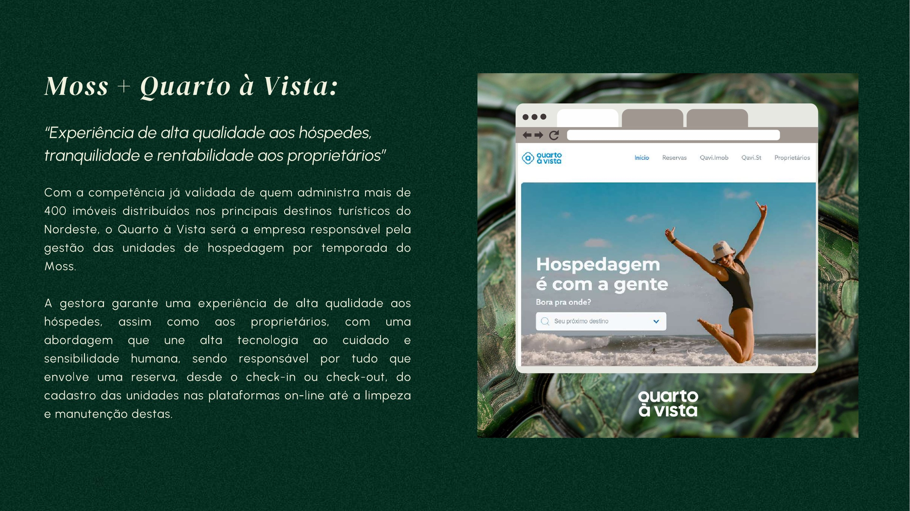

<html lang="pt-BR">
<head>
    <meta charset="UTF-8">
    <meta name="viewport" content="width=device-width, initial-scale=1.0">
    <title>MOSS - O equilíbrio perfeito entre o urbano e a natureza</title>
    <link rel="icon" href="imagens/favicon.ico" type="image/x-icon">
    <link rel="stylesheet" href="https://cdnjs.cloudflare.com/ajax/libs/font-awesome/6.0.0-beta3/css/all.min.css">
    
</head>
<body>
    <!-- Header -->
    <header>
        

            

                <svg width="64" height="64" viewBox="0 0 64 64">
                    <circle cx="32" cy="20" r="15" fill="#FFD700"/>
                    <rect x="20" y="25" width="24" height="30" fill="#1E90FF"/>
                    <path d="M10,50 Q32,45 54,50 L54,60 Q32,55 10,60 Z" fill="#87CEEB"/>
                </svg>
                <h1>MOSS</h1>
            

            
            

                

                

                

            

            
            <ul class="nav-links">
                <li><a href="#plantas">Plantas</a></li>
                <li><a href="#simule">Simule seu imóvel</a></li>
                <li><a href="#localizacao">Localização</a></li>
                <li><a href="#contato">Contato</a></li>
            </ul>
        

    </header>
    
    <!-- Gallery Section -->
    <section class="gallery" id="plantas">
        

            <h2 class="section-title">Conheça o MOSS</h2>
            

                

                    
                

                

                    
                

                

                    
                

                

                    
                

                

                    
                

                

                    
                

                

                    
                

                

                    
                

                

                    
                

                <!-- Imagens adicionais -->
                

                    
                

                

                    
                

                

                    
                

                

                    
                

            

            <button class="load-more">Veja mais</button>
        

    </section>
    
    <!-- Simulation Section -->
    <section class="simulation" id="simule">
        

            <h2 class="section-title">Simule seu imóvel</h2>
            
Preencha os campos abaixo para simular as condições de aquisição do seu flat no MOSS.

            
            

                

                    <label for="unidade">Selecione a Unidade</label>
                    <select id="unidade">
                        <option value="">Selecione uma unidade</option>
                        <option value="102" data-metragem="27.28" data-valor="392320.50" data-entrada="40000" data-parcela="1804.95" data-intercalada="8663.74" data-status="disponivel">102 - 27,28 m² - SUL - R$ 392.320,50</option>
                        <option value="201" data-metragem="34.01" data-valor="488043.50" data-entrada="50000" data-parcela="2200.00" data-intercalada="10000.00" data-status="disponivel">201 - 34,01 m² - SUL - R$ 488.043,50</option>
                    </select>
                

                
                

                    Valor Total do Imóvel:
                    R$ 0,00
                    
                

                
                

                    <label for="entrada">Entrada (mínimo 10% do valor do imóvel)</label>
                    <input type="text" id="entrada" placeholder="Ex: 40000 ou 40.000,00" oninput="formatCurrencyInput(this); updateCalculations()">
                    0%
                

                
                

                
                

                    Parcelamento:
                    48x
                

                
                

                    <label for="parcela">Valor da Parcela Mensal</label>
                    <input type="text" id="parcela" placeholder="Ex: 1804,95" oninput="formatCurrencyInput(this); updateCalculations()">
                    0%
                

                
                

                    Total das Parcelas (48x):
                    R$ 0,00
                    0%
                

                
                

                
                

                    <label for="intercalada">Valor de cada Intercalada (8x)</label>
                    <input type="text" id="intercalada" placeholder="Ex: 8663,74" oninput="formatCurrencyInput(this); updateCalculations()">
                    0%
                

                
                

                    Total das Intercaladas (8x):
                    R$ 0,00
                    0%
                

                
                

                    Subtotal antes das chaves:
                    R$ 0,00
                    0%
                

                
                

                
                

                    Para pegar as chaves:
                    R$ 0,00
                    0%
                

                
                

                    TOTAL À FINANCIAR (pós chaves):
                    R$ 0,00
                    0%
                

                
                <button type="button" id="enviar-simulacao" class="submit-btn">Enviar Simulação</button>
            

        

    </section>
    
    <!-- Modal de Imagem -->
    

        &times;
        

            
        

    

    
    
</body>
</html>
